# Project Title: Electronics-Inventory-Management-System - An Inventory Management System.

The Inventory Management System is a web-based application designed to help businesses efficiently manage their products, stock levels, categories, and inventory transactions. It aims to replace traditional manual methods such as paper records and spreadsheets, which are often prone to errors, delays, and inconsistencies.

## Key functional requirements or features of the system are:
•	User Authentication 

•	User Authorization

•	Product Management

•	Category Management

•	Inventory Transaction

•	User Management

•	Dashboard Report

## Technology Stack
### 1. Frontend Framework
For the main frontend, React.js with Vite is used with following additional libaries.

•	React Router DOM for navigation

•	Axios for sending and recieving HTTP request.

•	Redux Toolkit for global state management

•	React Toastify for user friendly toast notification

•	Lucide React Icons

### 2. Backend framework
Node.js with Express.js was used as the primary backend framework for the Inventory Management System due to its strong support for building RESTful APIs. Additional libraries used for backend are:

•	Mongoose as ORM

•	JWT (JSON Web Token) for session management

•	bcryptjs for hashing password

•	CORS middleware for frontend and backend communication

•	dotenv for retrieving environment variables

## Implementation Overview
 ### 1. Product Management
 •	In the Product Management feature, users can add new products by entering the required product details such as product name, category, price, quantity, and description. Once submitted, the product information is stored in the database and becomes available for inventory tracking and further operations such as updating stock or managing product listings.

 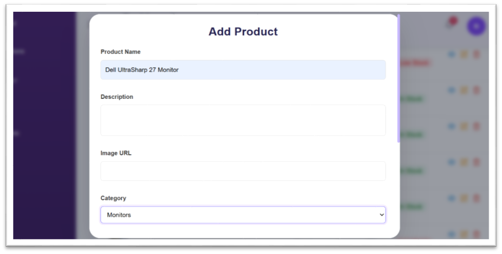

 •	Users can view detailed information about a product by clicking on the eye icon. This action opens a detailed view displaying all relevant product information such as name, category, price, quantity, and description.

 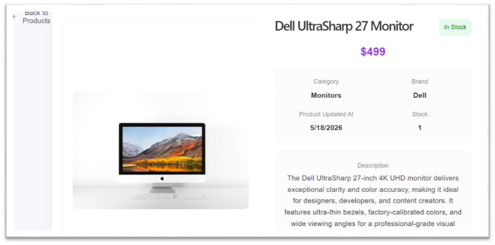

 ### 2. Category Management
 •	Similar to product management, the admin user can add new categories by entering the required category details. These categories help in organizing products into structured groups, making it easier to manage and track inventory efficiently.

 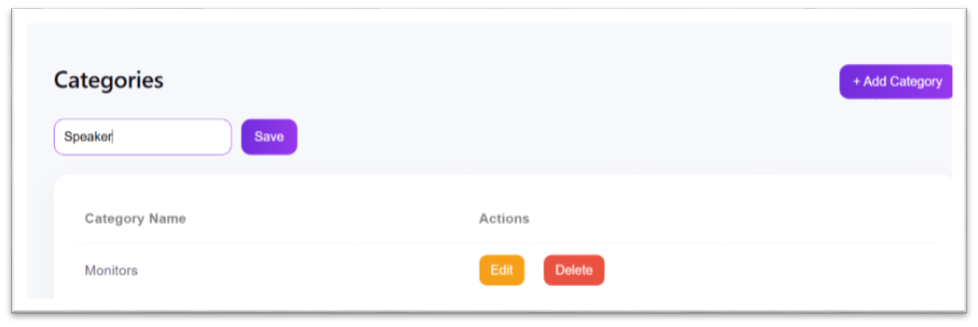

 •	Categories can be deleted by the admin user if they are no longer needed.
 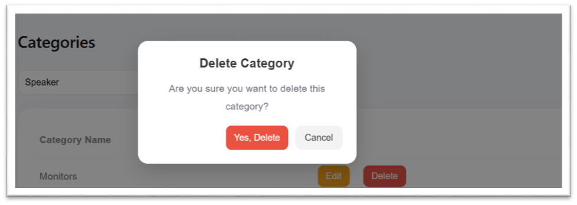

 ### 3. User Authentication and authorization
 •	Users are required to enter their username and password on the login page to authenticate themselves and gain access to the system. This ensures that only authorized users can access the Inventory Management System and its features.
 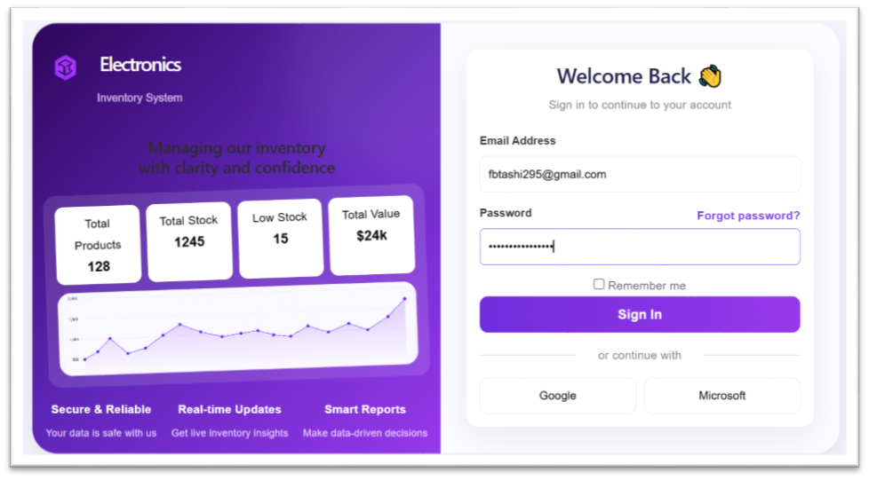

 ### 4. User Management
 •	Admin user can add new user to the system by entering their details such as name, email, password, and their role. The user details will be updated and stored in the database system.
 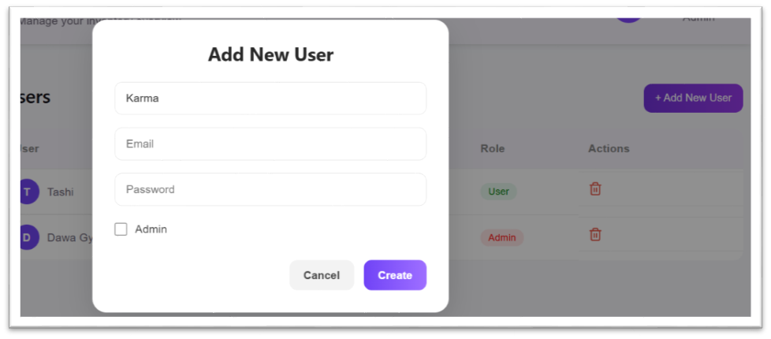

 ### 5.  Dashboard Summary
 •	The dashboard displays a summary report that provides a brief overview of the system, including key inventory statistics and important information for quick insight.
 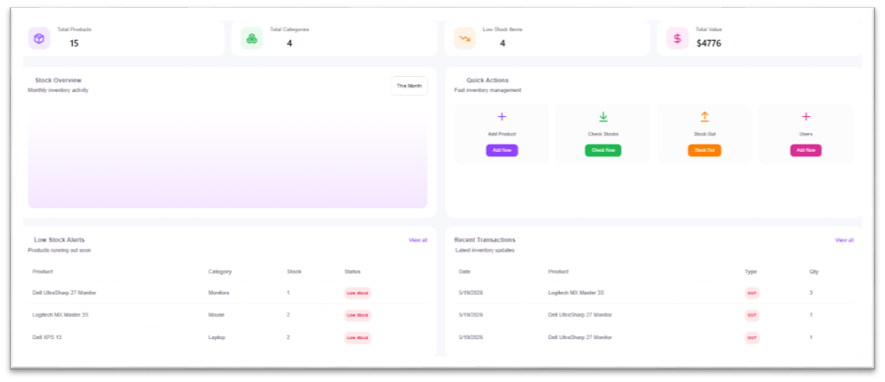

### 6. Stock Transaction
•	All stock-out transactions are displayed on the transactions page. This allows users to track and review inventory movements, ensuring better visibility and management of product usage within the system.
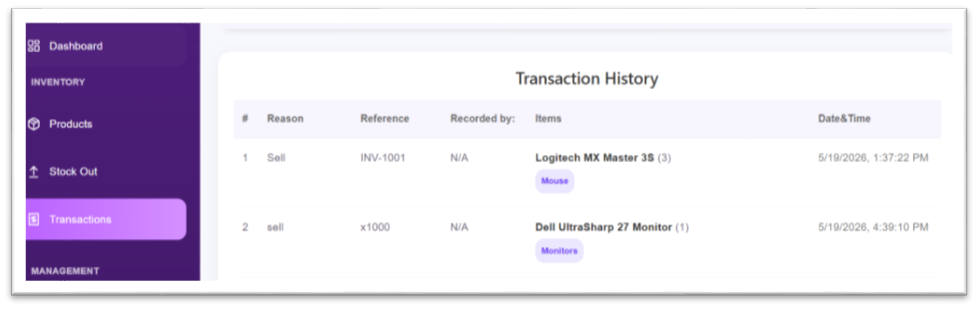

### Mobile View of the pages
1. Login page

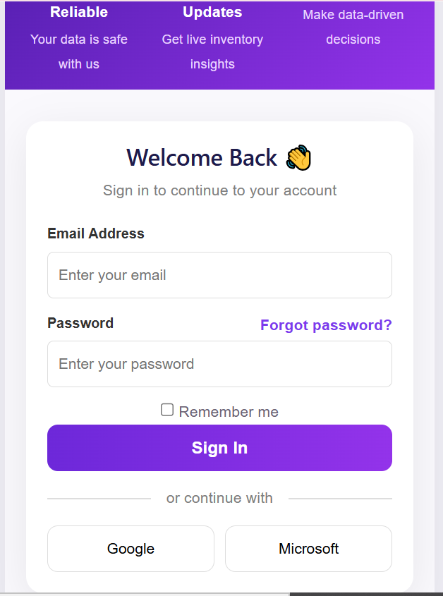

2. Dashboard

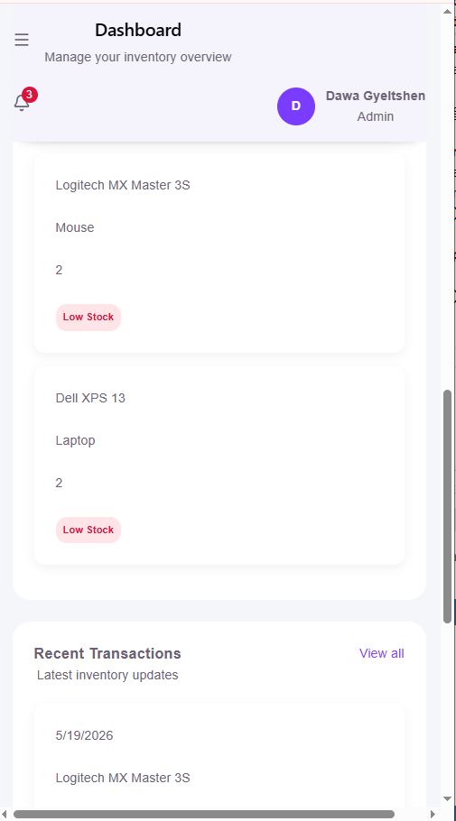

3. Add Product page

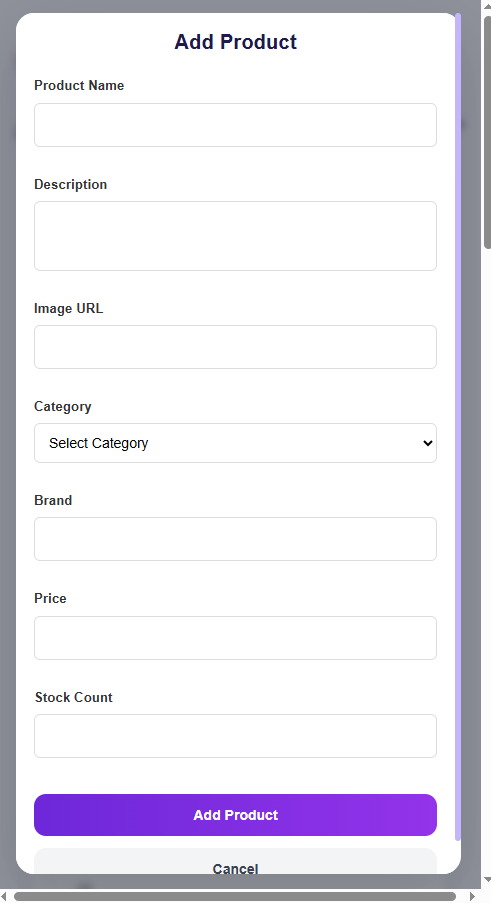

4. Transaction history page

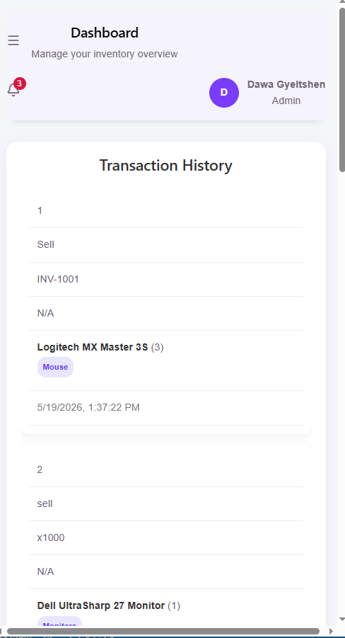

## Installation Instruction
### 1. Prerequisites
Before installing and running the system, ensure the following are installed:

•	Latest Node.js libarary

•	MongoDB Atlas

•	Git

### 2. Clone the Repository from GitHub
Open terminal and run the given command

git clone https://github.com/dgyel1993-arch/Electronics-Inventory-Management-System.git

### 3. Then navigate into the project repository first

cd Electronics-Inventory-Management-System

### 4. Then navigate into the frontend 

Run given command to navigate to frontend

 cd frontend 

### 5. Install the frontend dependencies using given command

npm install

### 6. Start the frontend development server (Vite server)
npm run dev

Your front end server is ready at http://localhost:5173

### 7. Now time to start our server, for that first navigate to server using given command

cd backend

### 8. Install the backend dependencies using given command
npm install

### 9. Start the frontend development server (Express server)
npm start

### 10. Open the browser and enter this link http://localhost:5173

### 11. Developers

- Tashi Namgay

- Dawa Gyeltshen

